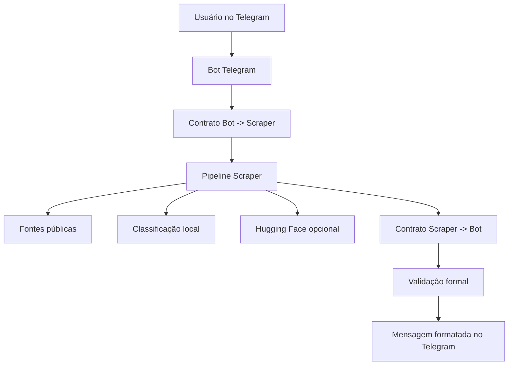

# OportuAcademi Bot — Web Scraper de Oportunidades Públicas

Bot Telegram para consultar oportunidades públicas e acadêmicas a partir de fontes institucionais. O usuário informa o país e o estado; o bot monta uma requisição JSON formal, executa uma pipeline de scraping com BeautifulSoup, normaliza os dados e devolve os resultados diretamente no Telegram.

O projeto foi adaptado para deploy no Railway como serviço persistente por polling, com enriquecimento opcional via Hugging Face Inference API.

---

## Sumário

- [Objetivo](#objetivo)
- [Resultado em produção](#resultado-em-produção)
- [Como o sistema funciona](#como-o-sistema-funciona)
- [Arquitetura](#arquitetura)
- [Stack](#stack)
- [Estrutura do projeto](#estrutura-do-projeto)
- [Fluxo no Telegram](#fluxo-no-telegram)
- [Contratos JSON](#contratos-json)
- [Variáveis de ambiente](#variáveis-de-ambiente)
- [Como executar localmente](#como-executar-localmente)
- [Deploy no Railway](#deploy-no-railway)
- [Configuração do Hugging Face](#configuração-do-hugging-face)
- [Testes](#testes)
- [Troubleshooting](#troubleshooting)
- [Segurança](#segurança)
- [Rollback](#rollback)
- [Limitações conhecidas](#limitações-conhecidas)
- [Roadmap](#roadmap)

---

## Objetivo

Automatizar a busca por oportunidades públicas e acadêmicas, principalmente:

- editais de mestrado;
- editais de doutorado;
- oportunidades pedagógicas;
- seleções públicas;
- oportunidades relacionadas a perito;
- links oficiais de edital, inscrição e documentos.

A ideia não é criar “mais um bot que raspa página”. Isso seria o mínimo, quase burocrático. O diferencial do projeto é transformar páginas públicas desorganizadas em respostas normalizadas, rastreáveis e úteis dentro do Telegram.

---

## Resultado em produção

### Railway com deploy ativo

O serviço roda no Railway como processo Python persistente. Ele não expõe rota HTTP pública porque o bot usa polling do Telegram.


### Bot respondendo no Telegram

Fluxo validado:

1. usuário envia `/start` ou `/buscar`;
2. bot solicita o país;
3. usuário envia `BR`;
4. bot solicita o estado;
5. usuário envia `PB`;
6. bot retorna oportunidades encontradas.


---

## Como o sistema funciona



O bot não processa HTML cru no Telegram. A interface só conversa com o scraper por contrato JSON. Essa separação evita o tipo de gambiarra que funciona em um teste e vira entulho no segundo deploy.

---

## Arquitetura

| Camada | Responsabilidade |
|---|---|
| Telegram Bot | Conversa com o usuário e coleta país/estado. |
| Contracts | Cria e valida os contratos JSON entre bot e scraper. |
| Scraper Client | Resolve qual backend será chamado por `SCRAPER_BACKEND`. |
| Pipeline Scraper | Coleta, filtra, normaliza e ordena oportunidades. |
| Sources | Parsers e fontes públicas iniciais. |
| Hugging Face | Enriquecimento/classificação opcional. |
| Messages | Renderização final das respostas no Telegram. |
| Railway | Hospedagem do worker Python em produção. |

---

## Stack

- Python 3.13
- python-telegram-bot
- BeautifulSoup4
- lxml
- requests
- Hugging Face Inference API opcional
- Railway
- GitHub

---

## Estrutura do projeto

```text
opportunities-intelligence-bot/
├── telegram_bot/
│   ├── bot.py
│   ├── contracts.py
│   ├── messages.py
│   └── scraper_client.py
│
├── scraper/
│   ├── pipeline.py
│   ├── sources.py
│   └── hf_classifier.py
│
├── schemas/
│   └── scraper_contract.py
│
├── tests/
│   └── ...
│
├── docs/
│   └── images/
│       ├── railway-deploy-success.png
│       └── telegram-bot-result.png
│
├── railway.json
├── render.yaml
├── requirements.txt
├── README.md
├── README_EN.md
└── README_FR.md
```

> `render.yaml` permanece apenas como alternativa de rollback/legado. O deploy principal validado neste projeto é Railway.

---

## Fluxo no Telegram

### Comandos principais

```text
/start
/buscar
```

### Conversa esperada

```text
Usuário: /buscar
Bot: País da busca? Envie BR.
Usuário: BR
Bot: Estado? Envie a sigla. Ex.: PB
Usuário: PB
Bot: Resultados encontrados...
```

### Estados do ConversationHandler

| Estado | Função |
|---|---|
| `ESPERANDO_PAIS` | Recebe o país da busca. Atualmente validado para `BR`. |
| `ESPERANDO_ESTADO` | Recebe a sigla da UF, por exemplo `PB`. |

Durante a execução do scraper, o bot envia status de digitação para sinalizar processamento.

---

## Contratos JSON

### Bot -> Scraper

```json
{
  "request_id": "11111111-1111-1111-1111-111111111111",
  "country": "BR",
  "state": "PB",
  "keywords": ["mestrado", "doutorado", "pedagogico", "perito"],
  "sources": ["ufpb", "editais_pb"],
  "language": "pt-BR",
  "limit": 20,
  "page": 1,
  "sort": "relevance",
  "include_closed": false
}
```

### Scraper -> Bot

```json
{
  "request_id": "11111111-1111-1111-1111-111111111111",
  "status": "success",
  "country": "BR",
  "state": "PB",
  "applied_filters": {
    "keywords": ["mestrado", "doutorado"],
    "sources": ["ufpb", "editais_pb"]
  },
  "summary": {
    "total_found": 15,
    "total_returned": 15,
    "partial_failures": 0
  },
  "items": [],
  "warnings": []
}
```

### Status permitidos

| Status | Quando usar |
|---|---|
| `success` | Busca concluída com resultados. |
| `empty` | Busca concluída sem resultados. |
| `partial_success` | Algumas fontes falharam, mas houve resultados válidos. |
| `error` | A busca falhou antes de retornar itens válidos. |

### Item normalizado

```json
{
  "item_id": "2fcb332afd49191f",
  "title": "Edital do Processo Seletivo para Mestrado e Doutorado",
  "category": "academic",
  "subcategory": "mestrado",
  "institution": "Universidade Federal da Paraíba",
  "source": "ufpb",
  "location": {
    "country": "BR",
    "state": "PB",
    "city": null
  },
  "published_at": "2026-06-25",
  "deadline": "2026-07-01",
  "status": "open",
  "match_tags": ["mestrado", "doutorado"],
  "description_clean": "Resumo limpo da oportunidade.",
  "source_url": "https://exemplo.gov.br/edital",
  "document_urls": ["https://exemplo.gov.br/edital.pdf"],
  "confidence": 0.92
}
```

---

## Variáveis de ambiente

| Variável | Obrigatória | Exemplo | Descrição |
|---|---:|---|---|
| `TELEGRAM_BOT_TOKEN` | Sim | `123456:ABC...` | Token criado no BotFather. |
| `SCRAPER_BACKEND` | Não | `scraper.pipeline:run_scraper_pipeline` | Função chamada pelo bot para executar o scraper. |
| `LOG_LEVEL` | Não | `INFO` | Nível de log da aplicação. |
| `HF_API_KEY` | Não | `hf_xxx` | Token Hugging Face para enriquecimento opcional. |
| `HF_ENDPOINT` | Não | URL de endpoint | Endpoint alternativo de inferência. Use só se souber o que está fazendo. |

### `.env.example`

```env
TELEGRAM_BOT_TOKEN=
SCRAPER_BACKEND=scraper.pipeline:run_scraper_pipeline
LOG_LEVEL=INFO
HF_API_KEY=
HF_ENDPOINT=
```

Nunca commite `.env`. Token vazado não é “incidente educativo”; é credencial comprometida.

---

## Como executar localmente

### 1. Criar ambiente virtual

```powershell
python -m venv .venv
.\.venv\Scripts\Activate.ps1
```

### 2. Instalar dependências

```powershell
pip install -r requirements.txt
```

### 3. Configurar variáveis no PowerShell

```powershell
$env:TELEGRAM_BOT_TOKEN="SEU_TOKEN_DO_BOTFATHER"
$env:SCRAPER_BACKEND="scraper.pipeline:run_scraper_pipeline"
$env:LOG_LEVEL="INFO"
$env:HF_API_KEY="hf_SEU_TOKEN_HUGGINGFACE"
```

### 4. Rodar o bot

```powershell
python -m telegram_bot.bot
```

### 5. Testar no Telegram

```text
/start
/buscar
BR
PB
```

---

## Deploy no Railway

### 1. Criar projeto

1. Acesse Railway.
2. Clique em **Deploy a new project**.
3. Escolha **Deploy from GitHub repo**.
4. Selecione o repositório do projeto.
5. Confirme o deploy.

### 2. Configurar variáveis

No serviço criado:

```text
Variables -> New Variable
```

Adicione:

```env
TELEGRAM_BOT_TOKEN=SEU_TOKEN_DO_BOTFATHER
SCRAPER_BACKEND=scraper.pipeline:run_scraper_pipeline
LOG_LEVEL=INFO
HF_API_KEY=hf_SEU_TOKEN_HUGGINGFACE
```

`HF_API_KEY` é opcional, mas necessária se você quiser usar enriquecimento via Hugging Face.

### 3. Configurar comando de inicialização

O comando principal deve ser:

```bash
python -m telegram_bot.bot
```

Se existir `railway.json`, ele pode declarar explicitamente o comando:

```json
{
  "$schema": "https://railway.app/railway.schema.json",
  "build": {
    "builder": "NIXPACKS"
  },
  "deploy": {
    "startCommand": "python -m telegram_bot.bot",
    "restartPolicyType": "ON_FAILURE",
    "restartPolicyMaxRetries": 10
  }
}
```

### 4. Conferir deploy

O Railway deve mostrar:

```text
Deployment successful
Service online
```

O serviço aparecerá como **Unexposed service**, e isso está correto. Bot por polling não precisa expor porta HTTP.

### 5. Testar o bot

No Telegram:

```text
/start
/buscar
BR
PB
```

Se retornar resultados, o deploy está funcional.

---

## Configuração do Hugging Face

### Permissões recomendadas do token

Use o menor privilégio possível:

```text
Read
Inference API
```

Não habilite permissões de escrita, administração, organizações, billing ou Spaces. O bot só precisa chamar inferência externa.

### Comportamento esperado

- Com `HF_API_KEY`: o sistema pode usar enriquecimento/classificação via Hugging Face.
- Sem `HF_API_KEY`: o sistema usa classificação determinística por palavras-chave.

Isso é proposital. A IA melhora a classificação, mas não deve ser ponto único de falha.

---

## Testes

### Suite completa

```powershell
python -B -m unittest discover -s tests
```

### Teste com fixture

```powershell
$env:SCRAPER_BACKEND="telegram_bot.scraper_client:fixture_scraper"
python -B -c "import asyncio; from telegram_bot.contracts import build_search_request; from telegram_bot.scraper_client import run_scraper; from telegram_bot.messages import render_response; req=build_search_request('BR','PB'); res=asyncio.run(run_scraper(req)); msgs=render_response(res); print(res['status'], res['summary']['total_found'], len(res['items']), 'Resultados' in msgs[0])"
```

Resultado esperado:

```text
success 1 1 True
```

---

## Troubleshooting

### `RuntimeError: TELEGRAM_BOT_TOKEN nao configurado`

Causa: variável obrigatória ausente.

Correção local:

```powershell
$env:TELEGRAM_BOT_TOKEN="SEU_TOKEN"
python -m telegram_bot.bot
```

Correção no Railway:

```text
Variables -> New Variable -> TELEGRAM_BOT_TOKEN
```

### `Unauthorized`

Causa: token inválido ou revogado.

Correção:

1. Abra o BotFather.
2. Gere novo token.
3. Atualize `TELEGRAM_BOT_TOKEN` no Railway.
4. Faça redeploy.

### Bot sobe, mas não responde

Verifique:

- se o deploy está `Online`;
- se `getUpdates` retorna `200 OK` nos logs;
- se não existe webhook antigo ativo;
- se você está falando com o bot correto.

### `ModuleNotFoundError`

Causa: dependência ausente ou estrutura incorreta.

Correção:

```powershell
pip install -r requirements.txt
python -m telegram_bot.bot
```

### Hugging Face não parece funcionar

Verifique:

- se `HF_API_KEY` existe no Railway;
- se o token tem permissão de inferência;
- se o sistema não está caindo no fallback determinístico.

---

## Segurança

- Nunca suba `.env` para o GitHub.
- Nunca cole token em issue, README, commit ou print público.
- Se um token aparecer em log compartilhado, revogue imediatamente no BotFather.
- Use `HF_API_KEY` apenas como variável de ambiente.
- Não logue headers, tokens ou payloads sensíveis.

### `.gitignore` recomendado

```gitignore
.venv/
venv/
__pycache__/
*.pyc
.env
.env.*
!.env.example
.pytest_cache/
.coverage
htmlcov/
logs/
*.log
.agents/
.codex/
```

---

## Rollback

### Railway

1. Acesse o serviço no Railway.
2. Vá em **Deployments**.
3. Selecione um deploy anterior estável.
4. Clique em redeploy/rollback, conforme a interface disponível.

### Render legado

O projeto ainda mantém `render.yaml` como referência de rollback para background worker:

```yaml
services:
  - type: worker
    name: oportunidades-publicas-telegram-bot
    runtime: python
    buildCommand: pip install -r requirements.txt
    startCommand: python -m telegram_bot.bot
```

Use apenas se quiser voltar ao Render.

---

## Limitações conhecidas

- Fontes públicas podem mudar HTML sem aviso.
- Sites podem retornar timeout, 503 ou bloqueio temporário.
- PDFs não são parseados profundamente; geralmente são retornados como links.
- Hugging Face gratuito pode ter cold start, latência ou limite de uso.
- Atualmente o bot está otimizado para `BR` e `PB`.
- Busca livre por texto ainda não está implementada.
- Seleção dinâmica de fontes ainda não está implementada.

---

## Roadmap

- Suporte a outros estados brasileiros.
- Comando `/fontes` para listar fontes disponíveis.
- Comando `/status` para verificar backend e Hugging Face.
- Cache de resultados para reduzir chamadas repetidas.
- Agendamento de alertas automáticos.
- Deduplicação avançada de editais.
- Extração mais profunda de PDFs.
- Resumo de edital com LLM quando `HF_API_KEY` estiver ativa.

---

## Status atual

- Deploy Railway: validado.
- Bot Telegram: validado.
- Busca `BR` + `PB`: validada.
- Retorno de resultados reais: validado.
- Hugging Face: opcional via variável `HF_API_KEY`.
- Render: mantido apenas como alternativa/rollback.
