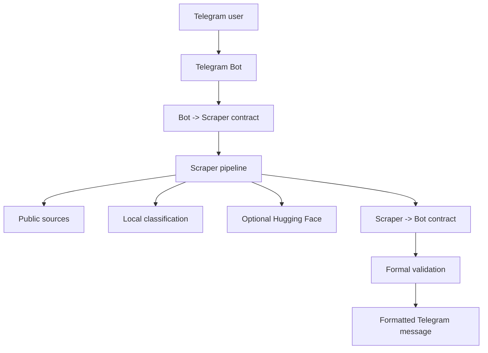

# OportuAcademi Bot — Public Opportunities Web Scraper

Telegram bot for searching public and academic opportunities from institutional sources. The user provides a country and a state; the bot builds a formal JSON request, runs a BeautifulSoup scraping pipeline, normalizes the data, and returns results directly in Telegram.

The project was adapted for Railway deployment as a persistent polling service, with optional enrichment through the Hugging Face Inference API.

---

## Overview

The bot helps users find:

- master's program calls;
- doctoral program calls;
- academic opportunities;
- public selection notices;
- opportunities related to expert/perito roles;
- official links to notices, registration pages, and documents.

The goal is not just to scrape pages. The project turns messy public pages into structured, validated, and useful Telegram responses.

---

## Production result

### Railway deployment

The service runs on Railway as a persistent Python process. It does not expose a public HTTP route because the Telegram bot uses polling.


### Telegram bot response

Validated flow:

1. user sends `/start` or `/buscar`;
2. bot asks for the country;
3. user sends `BR`;
4. bot asks for the state;
5. user sends `PB`;
6. bot returns opportunities.


---

## How it works



The Telegram layer does not process raw HTML. It only works with validated JSON returned by the scraper.

---

## Architecture

| Layer | Responsibility |
|---|---|
| Telegram Bot | Talks to the user and collects country/state. |
| Contracts | Builds and validates JSON contracts between bot and scraper. |
| Scraper Client | Resolves the backend configured in `SCRAPER_BACKEND`. |
| Scraper Pipeline | Collects, filters, normalizes, and sorts opportunities. |
| Sources | Initial public source parsers. |
| Hugging Face | Optional enrichment/classification. |
| Messages | Final Telegram message rendering. |
| Railway | Production hosting for the Python worker. |

---

## Stack

- Python 3.13
- python-telegram-bot
- BeautifulSoup4
- lxml
- requests
- Optional Hugging Face Inference API
- Railway
- GitHub

---

## Environment variables

| Variable | Required | Example | Description |
|---|---:|---|---|
| `TELEGRAM_BOT_TOKEN` | Yes | `123456:ABC...` | Token created in BotFather. |
| `SCRAPER_BACKEND` | No | `scraper.pipeline:run_scraper_pipeline` | Function called by the bot to run the scraper. |
| `LOG_LEVEL` | No | `INFO` | Application log level. |
| `HF_API_KEY` | No | `hf_xxx` | Optional Hugging Face token. |
| `HF_ENDPOINT` | No | endpoint URL | Alternative inference endpoint. Use only when needed. |

---

## Local execution

```powershell
python -m venv .venv
.\.venv\Scripts\Activate.ps1
pip install -r requirements.txt
$env:TELEGRAM_BOT_TOKEN="YOUR_BOTFATHER_TOKEN"
$env:SCRAPER_BACKEND="scraper.pipeline:run_scraper_pipeline"
$env:LOG_LEVEL="INFO"
$env:HF_API_KEY="hf_YOUR_HUGGINGFACE_TOKEN"
python -m telegram_bot.bot
```

Test in Telegram:

```text
/start
/buscar
BR
PB
```

---

## Railway deployment

1. Open Railway.
2. Click **Deploy a new project**.
3. Choose **Deploy from GitHub repo**.
4. Select the repository.
5. Add the variables:

```env
TELEGRAM_BOT_TOKEN=YOUR_BOTFATHER_TOKEN
SCRAPER_BACKEND=scraper.pipeline:run_scraper_pipeline
LOG_LEVEL=INFO
HF_API_KEY=hf_YOUR_HUGGINGFACE_TOKEN
```

The start command must be:

```bash
python -m telegram_bot.bot
```

If using `railway.json`:

```json
{
  "$schema": "https://railway.app/railway.schema.json",
  "build": {
    "builder": "NIXPACKS"
  },
  "deploy": {
    "startCommand": "python -m telegram_bot.bot",
    "restartPolicyType": "ON_FAILURE",
    "restartPolicyMaxRetries": 10
  }
}
```

The service can appear as **Unexposed service**. That is correct for a Telegram polling bot.

---

## Hugging Face setup

Recommended token permissions:

```text
Read
Inference API
```

Do not enable write, admin, billing, organization, or Spaces permissions. The bot only needs inference access.

With `HF_API_KEY`, the system can use Hugging Face enrichment. Without it, the scraper falls back to deterministic keyword classification.

---

## Tests

```powershell
python -B -m unittest discover -s tests
```

Fixture test:

```powershell
$env:SCRAPER_BACKEND="telegram_bot.scraper_client:fixture_scraper"
python -B -c "import asyncio; from telegram_bot.contracts import build_search_request; from telegram_bot.scraper_client import run_scraper; from telegram_bot.messages import render_response; req=build_search_request('BR','PB'); res=asyncio.run(run_scraper(req)); msgs=render_response(res); print(res['status'], res['summary']['total_found'], len(res['items']), 'Resultados' in msgs[0])"
```

Expected result:

```text
success 1 1 True
```

---

## Troubleshooting

### `TELEGRAM_BOT_TOKEN nao configurado`

The required Telegram token is missing. Add `TELEGRAM_BOT_TOKEN` locally or in Railway variables.

### `Unauthorized`

The Telegram token is invalid or revoked. Generate a new token in BotFather and redeploy.

### Bot starts but does not answer

Check whether Railway is online, `getUpdates` returns `200 OK`, no old webhook is active, and you are talking to the correct bot.

### Hugging Face does not seem active

Check whether `HF_API_KEY` exists and has inference permissions.

---

## Security

- Never commit `.env`.
- Never expose Telegram or Hugging Face tokens in logs, README, issues, or screenshots.
- If a token is exposed, revoke it immediately.
- Keep `HF_API_KEY` in environment variables only.

---

## Current status

- Railway deployment: validated.
- Telegram bot: validated.
- Search `BR` + `PB`: validated.
- Real result rendering: validated.
- Hugging Face: optional through `HF_API_KEY`.
- Render: kept only as fallback/legacy deployment.
