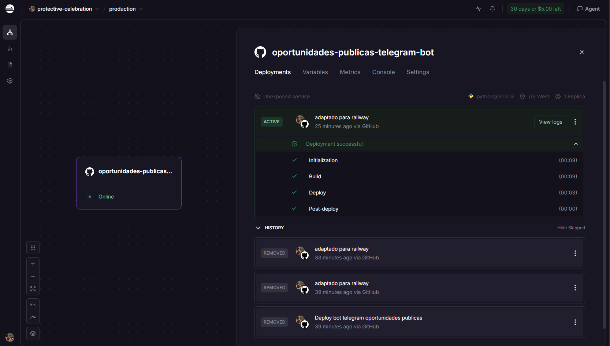
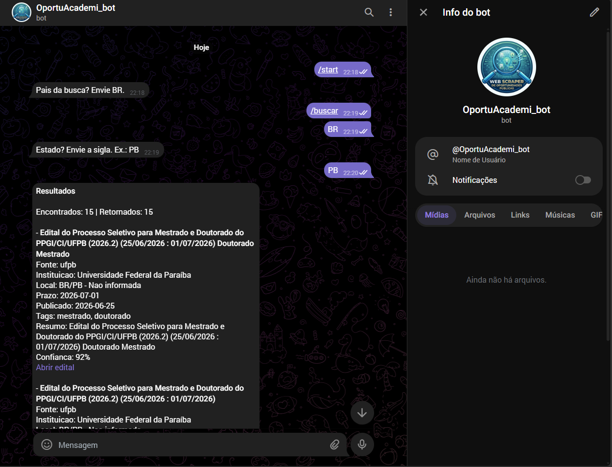
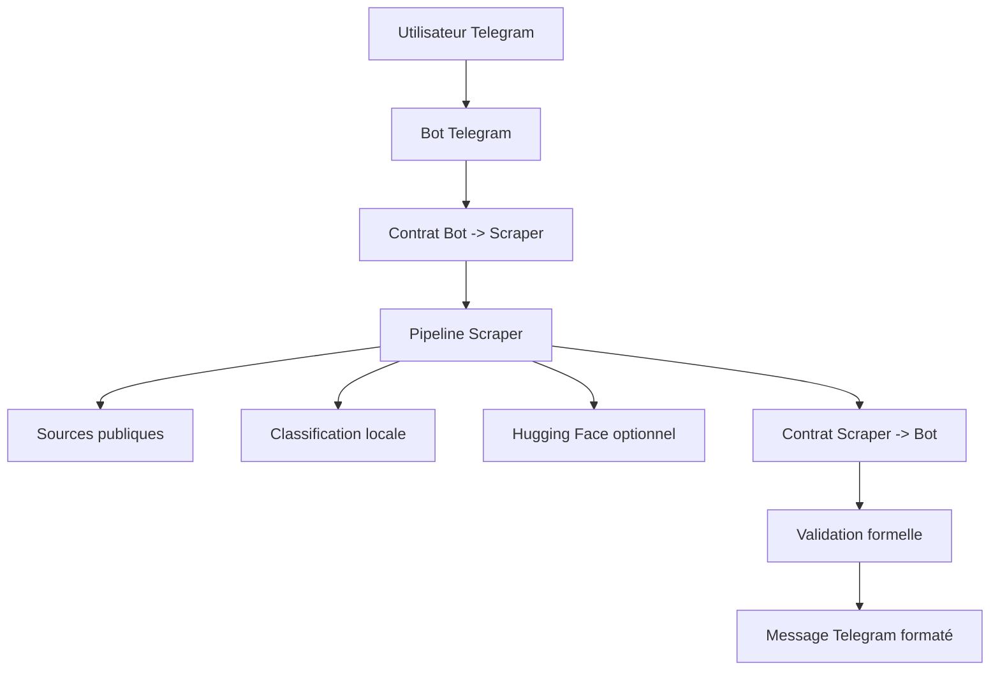

# OportuAcademi Bot — Web Scraper d'Opportunités Publiques

Bot Telegram permettant de rechercher des opportunités publiques et académiques à partir de sources institutionnelles. L'utilisateur informe le pays et l'État ; le bot crée une requête JSON formelle, exécute une pipeline de scraping avec BeautifulSoup, normalise les données et renvoie les résultats directement dans Telegram.

Le projet a été adapté pour un déploiement Railway comme service persistant par polling, avec enrichissement optionnel via l'API Hugging Face Inference.

---

## Vue d'ensemble

Le bot aide à trouver :

- des appels à candidatures de master ;
- des appels à candidatures de doctorat ;
- des opportunités académiques ;
- des sélections publiques ;
- des opportunités liées au rôle de perito/expert ;
- des liens officiels vers les avis, inscriptions et documents.

Le but n'est pas simplement de scraper des pages. Le projet transforme des pages publiques désorganisées en réponses Telegram structurées, validées et utiles.

---

## Résultat en production

### Déploiement Railway

Le service fonctionne sur Railway comme processus Python persistant. Il n'expose pas de route HTTP publique, car le bot Telegram utilise le polling.



### Réponse du bot Telegram

Flux validé :

1. l'utilisateur envoie `/start` ou `/buscar` ;
2. le bot demande le pays ;
3. l'utilisateur envoie `BR` ;
4. le bot demande l'État ;
5. l'utilisateur envoie `PB` ;
6. le bot retourne les opportunités trouvées.



---

## Fonctionnement



La couche Telegram ne traite pas le HTML brut. Elle utilise uniquement le JSON validé renvoyé par le scraper.

---

## Architecture

| Couche | Responsabilité |
|---|---|
| Telegram Bot | Dialogue avec l'utilisateur et collecte pays/État. |
| Contracts | Crée et valide les contrats JSON entre bot et scraper. |
| Scraper Client | Résout le backend configuré dans `SCRAPER_BACKEND`. |
| Scraper Pipeline | Collecte, filtre, normalise et trie les opportunités. |
| Sources | Parsers des sources publiques initiales. |
| Hugging Face | Enrichissement/classification optionnelle. |
| Messages | Rendu final des messages Telegram. |
| Railway | Hébergement de production du worker Python. |

---

## Stack

- Python 3.13
- python-telegram-bot
- BeautifulSoup4
- lxml
- requests
- Hugging Face Inference API optionnelle
- Railway
- GitHub

---

## Variables d'environnement

| Variable | Obligatoire | Exemple | Description |
|---|---:|---|---|
| `TELEGRAM_BOT_TOKEN` | Oui | `123456:ABC...` | Token créé dans BotFather. |
| `SCRAPER_BACKEND` | Non | `scraper.pipeline:run_scraper_pipeline` | Fonction appelée par le bot pour exécuter le scraper. |
| `LOG_LEVEL` | Non | `INFO` | Niveau de log de l'application. |
| `HF_API_KEY` | Non | `hf_xxx` | Token Hugging Face optionnel. |
| `HF_ENDPOINT` | Non | URL d'endpoint | Endpoint alternatif d'inférence. À utiliser seulement si nécessaire. |

---

## Exécution locale

```powershell
python -m venv .venv
.\.venv\Scripts\Activate.ps1
pip install -r requirements.txt
$env:TELEGRAM_BOT_TOKEN="VOTRE_TOKEN_BOTFATHER"
$env:SCRAPER_BACKEND="scraper.pipeline:run_scraper_pipeline"
$env:LOG_LEVEL="INFO"
$env:HF_API_KEY="hf_VOTRE_TOKEN_HUGGINGFACE"
python -m telegram_bot.bot
```

Test dans Telegram :

```text
/start
/buscar
BR
PB
```

---

## Déploiement sur Railway

1. Ouvrez Railway.
2. Cliquez sur **Deploy a new project**.
3. Choisissez **Deploy from GitHub repo**.
4. Sélectionnez le dépôt.
5. Ajoutez les variables :

```env
TELEGRAM_BOT_TOKEN=VOTRE_TOKEN_BOTFATHER
SCRAPER_BACKEND=scraper.pipeline:run_scraper_pipeline
LOG_LEVEL=INFO
HF_API_KEY=hf_VOTRE_TOKEN_HUGGINGFACE
```

La commande de démarrage doit être :

```bash
python -m telegram_bot.bot
```

Si vous utilisez `railway.json` :

```json
{
  "$schema": "https://railway.app/railway.schema.json",
  "build": {
    "builder": "NIXPACKS"
  },
  "deploy": {
    "startCommand": "python -m telegram_bot.bot",
    "restartPolicyType": "ON_FAILURE",
    "restartPolicyMaxRetries": 10
  }
}
```

Le service peut apparaître comme **Unexposed service**. C'est normal pour un bot Telegram qui utilise le polling.

---

## Configuration Hugging Face

Permissions recommandées du token :

```text
Read
Inference API
```

N'activez pas les permissions write, admin, billing, organization ou Spaces. Le bot a seulement besoin d'accéder à l'inférence.

Avec `HF_API_KEY`, le système peut utiliser l'enrichissement Hugging Face. Sans cette variable, le scraper utilise une classification déterministe par mots-clés.

---

## Tests

```powershell
python -B -m unittest discover -s tests
```

Test avec fixture :

```powershell
$env:SCRAPER_BACKEND="telegram_bot.scraper_client:fixture_scraper"
python -B -c "import asyncio; from telegram_bot.contracts import build_search_request; from telegram_bot.scraper_client import run_scraper; from telegram_bot.messages import render_response; req=build_search_request('BR','PB'); res=asyncio.run(run_scraper(req)); msgs=render_response(res); print(res['status'], res['summary']['total_found'], len(res['items']), 'Resultados' in msgs[0])"
```

Résultat attendu :

```text
success 1 1 True
```

---

## Dépannage

### `TELEGRAM_BOT_TOKEN nao configurado`

Le token Telegram obligatoire est absent. Ajoutez `TELEGRAM_BOT_TOKEN` localement ou dans les variables Railway.

### `Unauthorized`

Le token Telegram est invalide ou révoqué. Générez un nouveau token dans BotFather puis redéployez.

### Le bot démarre mais ne répond pas

Vérifiez que Railway est en ligne, que `getUpdates` retourne `200 OK`, qu'aucun ancien webhook n'est actif et que vous parlez au bon bot.

### Hugging Face ne semble pas actif

Vérifiez que `HF_API_KEY` existe et possède les permissions d'inférence.

---

## Sécurité

- Ne commitez jamais `.env`.
- N'exposez jamais les tokens Telegram ou Hugging Face dans les logs, README, issues ou captures publiques.
- Si un token est exposé, révoquez-le immédiatement.
- Gardez `HF_API_KEY` uniquement dans les variables d'environnement.

---

## État actuel

- Déploiement Railway : validé.
- Bot Telegram : validé.
- Recherche `BR` + `PB` : validée.
- Rendu de résultats réels : validé.
- Hugging Face : optionnel via `HF_API_KEY`.
- Render : conservé uniquement comme déploiement de secours/héritage.
